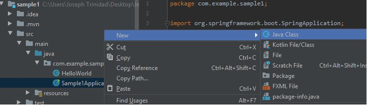

Create a Spring Boot App - Hello World

1. Download IntelliJ Community Edition - Open Source (https://www.jetbrains.com/idea/download/#section=windows). This is an IDE(Integrated Development Environment) for developing Java (Kotlin, Groovy) applications.

2. Go to Spring Initializer (https://start.spring.io/) and generate the Spring Boot dependencies.

2.1 Project>Maven; Language>Java; Spring Boot>2.2.5; Project Metadata>Group>(create your file name, eg. com.example); Artifact>(create name, eg. demo); Dependencies>(Add dependencies such as Spring Web, REST Repositories)

2.2 Click Generate.

2.3 Download the generated Spring Boot dependencies and unzip to your desired file path.

3. Open IntelliJ and select Import Project and choose the unzipped file of your Spring Boot dependencies. Wait for a while for the packages to build.

4. Navigate to the left side pane of IntelliJ (Project Name>src>main>java>com.example.sample1>Sample1Application) and open the Main Application of Java.

5. Make sure that @SpringBootApplication package has been imported. This should be outside and before the name of your Java Class (Sample1Application).

6. Run the Apache/Tomcat(web server) by clicking the Play/Run button beside the class name of your main application. A terminal will appear at the bottom of the IntelliJ interface. This should be working and compiling with no errors.

7. Go to your browser and go to the localhost:8080 path. This will show you a raw JSON file with Links, Profile, and Href in an array inside the curly braces{}.

8. Create another Java class under the com.example.sample1 package by right-clicking the package name/icon and hover to New>Java Class. Name this as HelloWorld (Java Class naming convention should be done in Pascal case--each word begins with a capital letter e.g. "HelloWorld, SpringBoot, AnArrayOfObjects)

9. Create a simple function that will return a string of "Hello World!" in HelloWorld class (see code in IDE).

10. Remember to import a @RESTcontroller before the class declaration. This is the dependency that we have downloaded from Spring Initializer (Rest Repositories).

11. Put a @RequestMapping so the function will know what path in web address it will show the string of the function (e.g. ("/") ).

12. Go back to the Sample1Application(main application and run the server).

13. Go to your browser and type localhost:8080 (this is the local server of apache), the browser should output the string of "Hello World!" that you have created.

